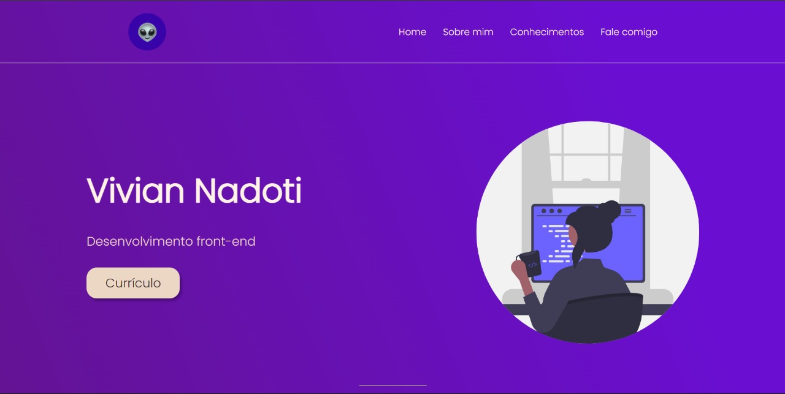

<h1> Landing page - Portfolio </h1>

Projeto realizado com base na aula da Rafaella Ballerini no [Youtube](https://www.youtube.com/watch?v=llF6vD-RljE&t=678s)
 
[Clique aqui]() para ver o preview do site 

  

---

## 🚀 Tecnologias

Esse projeto foi desenvolvido com as seguintes tecnologias:

	
	

 

---

## 📚 Bibliotecas

- [Google Fonts](https://fonts.google.com/)
- [unDraw](https://undraw.co/illustrations)

---

## 💻 Projeto

Landing page, responsiva, para usar em diversos tipos de projetos. O projeto original mostrava como fazer sua própria Landing Page (no caso do vídeo, para um bot do discord).Adaptei a ídeia para minhas necessidades, e assim criei o meu portifolio, que contém as seguintes seções: Header, Navigation, Home, Sobre, Conhecimentos, Fale comigo, Contato e Footer.

---

## 🔖 Layout

Você pode visualizar o layout original do projeto através [desse link](https://www.figma.com/file/myqP66iQwzjwjrIAJyyrip/BalleBot?node-id=0%3A1). É necessário ter conta no [Figma](https://figma.com) para acessá-lo.

---

Feito com ♥ by VivianNadoti